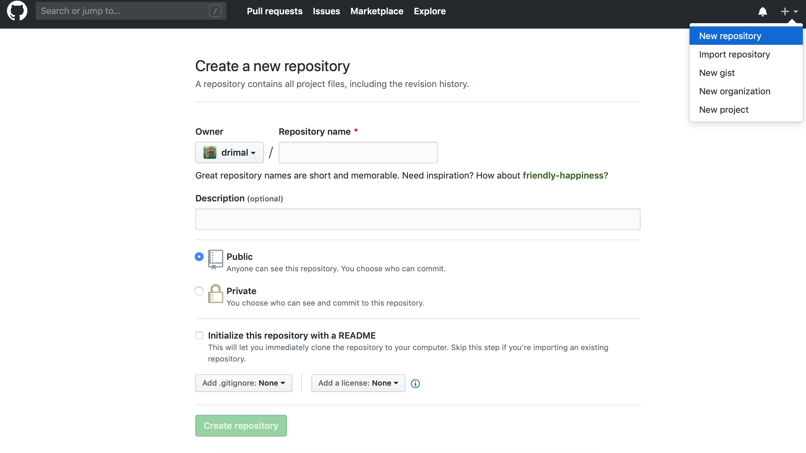

### Initialize git repository from existing directory:
`$cd DIRECTORY `
`$git init`
`$git add .`
`$git add README.md`
`$git commit -m "Say Something About the repository" *`

## Now go to your github profile page on the web a create a new repository with some name(for eg repo_name) and then go back to the terminal

`$git remote add origin git://github.com:USERNAME/repo_name.git`
`$git push -u origin master`
